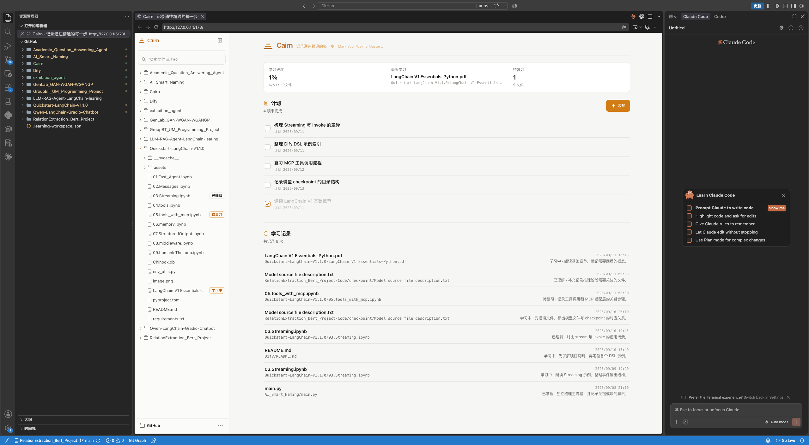
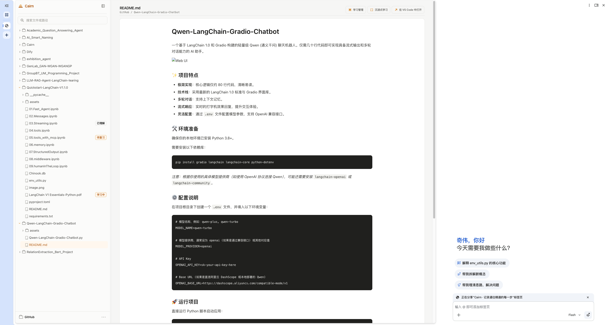

# Cairn · Mark Your Way to Mastery.

<p align="center">
  
</p>

> 把“我看过了”变成“我知道下一步要学什么”。

Cairn 是一个 **local-first 学习上下文与记忆层**：它把分散在本地文件、网页阅读、VS Code 和 AI 协作中的学习过程，汇总成可回看的学习状态、笔记、计划和复习记录。

Cairn 不替代 Gemini、Copilot、Codex、Claude Code 或 VS Code。它负责保存“学了什么、学到哪一步、下一次何时继续”，让你可以在熟悉的 AI 和编辑器环境里学习，同时留下连续的轨迹。

## 在线体验

**<https://kiwiwu02.github.io/Cairn/>** —— 当前唯一线上入口，随本仓库自动部署，推送到 `main` 即更新，不含任何平台注入内容。

国内网络访问 GitHub 的稳定性随时段和运营商波动较大。如果这个地址打不开，Cairn 本身是纯静态应用，按[本地集成](#本地集成)里的命令在本地跑起来即可，功能完全一致。

线上版本仍然是 local-first：页面只把文件读进浏览器，学习记录写在你选中的本地文件夹里，站点本身不接收账号、不上传文件、也没有云端同步。

| 能力 | 线上可用情况 |
| --- | --- |
| 示例学习库 | 全部浏览器可用，无需选择文件夹 |
| 打开本地文件夹、阅读、记录学习 | 需要最新版 Chrome 或 Edge（依赖 File System Access API 与安全上下文） |
| 在 VS Code 中打开 | 线上版保留按钮但不启用关联，悬浮时显示“当前版暂不支持 VS Code 关联，请从 Github 克隆到本地使用此功能”；本地 Bridge 模式可用，见[本地集成指南](docs/local-integration.md) |

Safari 和 Firefox 可以正常浏览示例学习库，但本地文件夹能力受限。

## 特性

- **本地优先**：直接管理真实文件夹，不需要账号、数据库或云端同步。
- **文件式数据**：学习状态、计划和学习记录保存在文件夹根目录的 `.cairn-workspace.json` 中。
- **多格式阅读**：支持 Markdown、纯文本、常见代码、Jupyter Notebook、PDF、`.docx` 和图片。
- **主动记录学习**：打开文件不会自动记为学习，点击“记录本次学习”才会新增记录。
- **持续学习**：同一文件可以记录多次学习，保留每一次的时间、状态和学习内容。
- **计划与复习**：支持学习中、已理解、已掌握、待复习，以及下次复习日期。
- **学习概览**：在工作台查看学习进度、最近学习、计划和待复习文件。
- **沉浸式阅读**：隐藏工作区干扰，适合连续阅读和学习。
- **主题与语言**：支持多套主题色、日间/夜间模式以及中文/English。
- **VS Code 协同**：macOS 上通过本地桥接服务在 VS Code 中打开当前文件，也可以在 VS Code 内置浏览器中使用 Cairn。
- **示例学习库**：无需选择本地文件夹即可体验主要流程。

## 产品定位

很多学习发生在编辑器、浏览器和 AI 对话里，但“看过”通常不会自动变成可追踪的学习记录。Cairn 解决的是这段断层：

```text
本地资料 → 网页 / VS Code 阅读与 AI 协作 → 主动记录 → 状态、笔记与复习
```

| 学习场景 | 你在哪里学习 | Cairn 负责什么 |
| --- | --- | --- |
| 网页端学习 | Cairn 阅读器 + 浏览器里的 Gemini、Copilot 等工具 | 文件树、阅读、学习记录与复习入口 |
| VS Code 协同 | VS Code 编辑器 / 内置浏览器 + Codex、Claude Code、Copilot 等扩展 | 打开同一份文件，并记录学习上下文 |
| 持续复习 | 下次回到同一个文件 | 查看历史次数、备注、状态和复习日期 |

截图中的 Gemini、Copilot、Claude Code 等面板属于浏览器或 VS Code 中的外部工具，不是 Cairn 内置的模型服务。Cairn 不会自动把文件内容发送给这些工具，是否提供上下文由你决定。

## 使用示例

### 一个工作台连接多个学习场景

<p align="center">
  
</p>
<p align="center"><sub>学习进度、计划和最近记录集中在一个工作台，同时保留 VS Code 与 AI 工具的工作方式。</sub></p>

### 在网页中阅读，并在需要时借助 AI

<p align="center">
  
</p>
<p align="center"><sub>在 Cairn 中阅读本地资料；浏览器侧的 AI 工具可以作为并行的学习伙伴。</sub></p>

## 本地集成

Cairn 直接连接你选择的本地学习资料目录，不复制资料，也不要求数据库或云端账号。安装、绑定文件夹、VS Code 协同和给 AI 的可复制提示词，请阅读[本地集成指南](docs/local-integration.md)。

最短启动路径：

```bash
git clone https://github.com/kiwiwu02/Cairn.git
cd Cairn
npm ci
npm run dev
```

打开本地地址后，点击“打开本地文件夹”即可连接自己的学习资料。

## 数据与隐私

- Cairn 没有内置云端同步、账号系统或数据上传接口。
- 学习状态、计划和学习记录与原文件放在同一个本地文件夹中，可以随文件夹一起备份。
- `.cairn-workspace.json` 及其临时文件已加入 `.gitignore`，不会被默认提交。
- Cairn 不存储 Gemini、Copilot、Codex 或 Claude Code 的对话；外部 AI 是否接收文件内容由你在对应工具中主动决定。
- Markdown、Notebook 或 DOCX 中的外部图片地址可能会被浏览器请求；如果资料包含敏感内容，请避免使用不可信的外链资源。
- 本地桥接服务只建议在自己的电脑上运行，并保持默认回环监听。

## 参与贡献

欢迎通过 Issue 或 Pull Request 提交问题和改进。提交前请至少运行：

```bash
npm run build
```

请不要提交真实学习资料、`.cairn-workspace.json`、个人路径、密钥或其他私人配置。

## 许可证

[MIT License](LICENSE)。第三方依赖及其许可证见[本地集成指南](docs/local-integration.md)。
